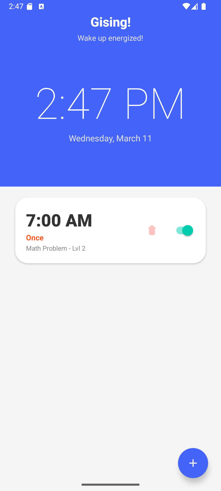
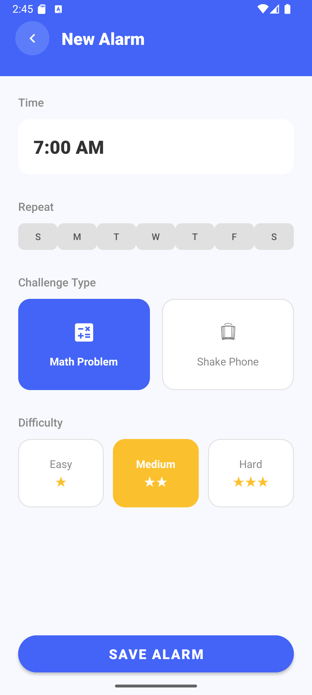
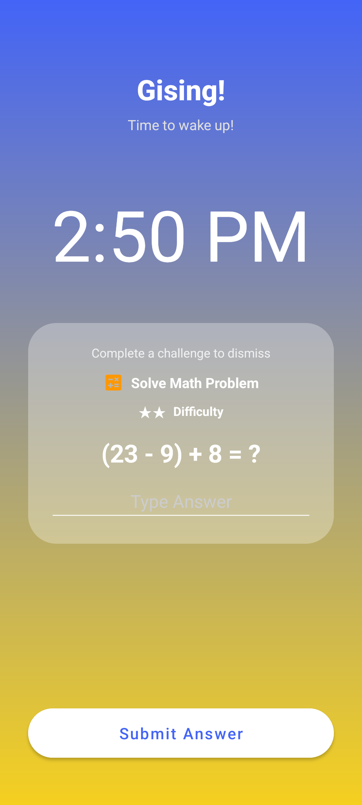
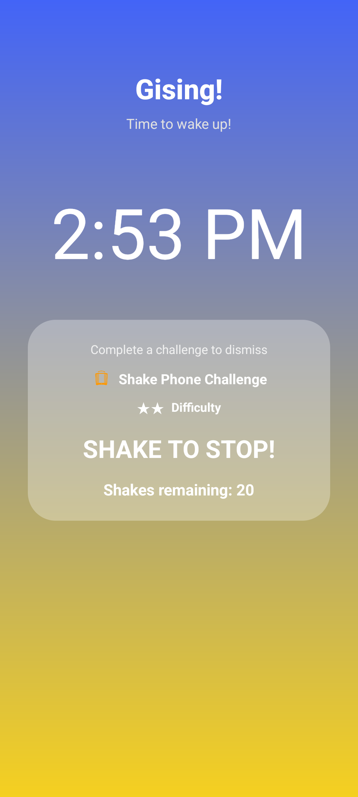

# GisingApp

GisingApp is an Android alarm clock that requires you to complete a short challenge to stop the alarm (solve a math problem or shake your phone).

## Overview
- Purpose: Make waking up harder to ignore by requiring a challenge to dismiss alarms.
- Challenges: Math problem, Shake phone.
- Difficulties: Easy / Medium / Hard.

## Quick start
Prerequisites: Android Studio or Android SDK + Gradle wrapper, a device or emulator.

1. Clone
```bash
git clone https://github.com/Clarence212/GisingApp.git
cd GisingApp
```

2. Build and install (device/emulator)
```bash
./gradlew assembleDebug
./gradlew installDebug
```
Or open the project in Android Studio and Run.

## How to use (in-app)
1. Tap the + button to add an alarm.  
2. Set time and repeat.  
3. Choose a challenge type (Math problem or Shake phone) and a difficulty (Easy, Medium, Hard).  
4. When the alarm rings, complete the challenge to stop it.

   

## Project structure
Top-level layout (what you'll find in the repo root)
```
GisingApp/
├── app/                      # Android app module: source code, resources, manifests
│   ├── src/
│   │   ├── main/
│   │   │   ├── java/          # Java/Kotlin source
│   │   │   ├── res/           # layouts, drawables, values
│   │   │   └── AndroidManifest.xml
│   │   └── androidTest/       # instrumented tests
│   └── build.gradle.kts       # module Gradle settings (if present)
├── build.gradle.kts           # top-level Gradle (Kotlin DSL)
├── settings.gradle.kts
├── gradle.properties
├── gradlew / gradlew.bat
├── gradle/                    # Gradle wrapper files
├── docs/                      # images and docs (add initialscreen.png here)
└── README.md
```

## Notes
- No environment variables required. Test alarms on a real device or emulator with sound enabled.
- Keep an eye on Android Do Not Disturb / battery optimization settings when testing alarms.

## Contribution
1. Fork the repository
2. Create a new branch
3. Commit your changes
4. Submit a Pull Request

## License
This project is licensed under the [MIT License](LICENSE)
